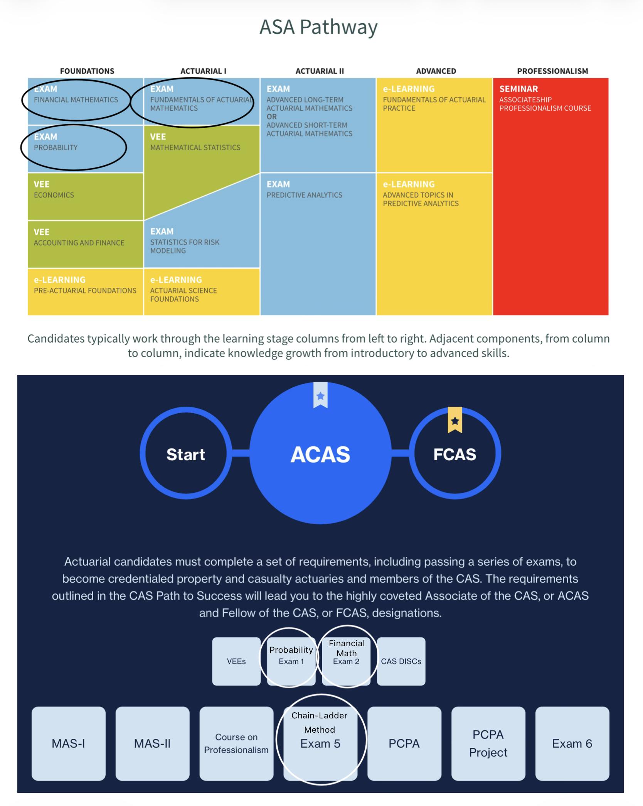

## Closing

Thank you for taking the time to explore Actuarial Packages with me! As you can see, there is a lot of power behind the R packages provided by incredible individuals; I'll take the time to credit them here. Many thanks to...

```{r}
library(lifecontingencies)
library(ChainLadder)

citation("lifecontingencies"); citation("ChainLadder")
```

Everything we learned is important and particular to the work that can be done in various Actuarial job positions. As an Actuary Student, here are the exams that we addressed through the discussed topics...



To close this project, I want to help you work with R studio and more Actuary exam topics. There are still many capabilities within each package that I did not address, so in this project folder, I have a "Materials_Questions" folder that has SOA questions/solutions for both the "Financial Mathematics" and the "Probability" Actuary exams. Feel free to explore the questions and see how the many functions can help you answer them! Remember, you may not be able to use this on exam day, but you will appreciate having yet another way to think about exam-related problems!