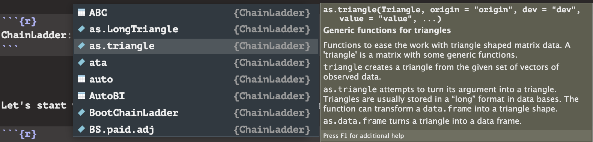
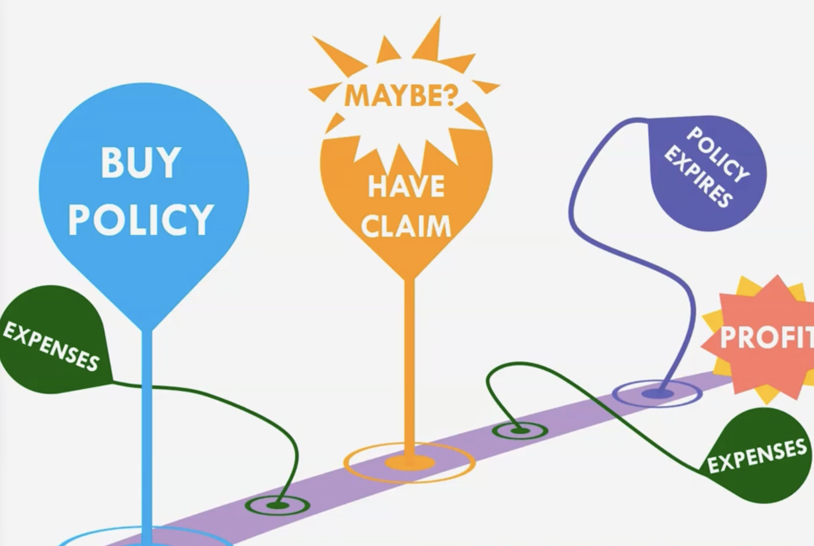

## Introduction

Welcome to the second part of my "Actuarial Packages" project! Here we are going to take a quick look at what R/R studio can do in regards of "Claims and Reserves"! If we were discussing topics for the SOA before, then this brief discussion will look at a topic to contribute to the Associate of the Casualty Actuary Society (ACAS), which is a part of...


Let's start by loading some packages again...

```{r Library}
#| warning: false
library(ChainLadder) # This is all we need :)
```

...packages, more like, "package"; it is pretty surprising, but with how up-to-date `ChainLadder` is, a lot of talking points and visualizations can be done with just this package.

## Claims and Reserves

Like before, feel free to use tab completion on the next code chunk to look around at the many datasets and functions within `ChainLadder`!

```{r Exploration}
# ChainLadder::
```

After looking around, you might notice...



There is a lot of mentions of "triangles", but what is a triangle in this context? An "Actuarial Triangle" is the ongoing record of how much money a company is keeping in "reserves" for the many possibilities of an individual making a claim during a given period of time. Like before, a company has to deal with risk assessment as they do not know when an outcome is going to happen for several individuals, but in this case, actuaries need to assess the probability of individuals making a claim (or possibly letting the policy expire); this also needs to take into consideration several expenses that can occur as time passes. Here is a visual to help demonstrate this...


Credit to...

for the picture; feel free to watch her video over this topic too (it's great)! But still, why a "triangle"? To help answer this, let's take a look at a General Insurance data set called `GenIns`. The `GenIns` data set will already be in the form of a matrix that is specifically a "triangle"; `ChainLadder` has a special `show()` function that will take the matrix and display it in a typical Actuarial Triangle. Let's do that...

```{r show}
show(GenIns)
```

Tada! Pretty cool! Now let's start breaking down what this all means. On the top-left corner, we have two terms, "dev" and "origin". "dev" stands for "development", which means that as time passes, the company that issued the policy is able to learn more information regarding the holder and the potential changes to the policy (claims? expenses?). The company understands more, so we say that the policy has "developed". Then there is "origin", which simply is the time that the policy was first issued. In this case, `GenIns` information was recorded on a monthly basis. Now we can infer the reasoning behind the triangle; if a policy was bought within the first month and ten months pass, then that policy has had a total of ten development periods. Meanwhile, if a policy was bought within the tenth month, then that policy has only had the one month to develop.

Now, you might be wondering, there are a lot of NAs, is there something that we can do with those? And, yes! We can take advantage of the trends between development periods to infer what development could look like for policies that were purchased later. Notice for a policy of origin ten, there are nine other policy origins that we can infer a trend from. Let's start by looking at the development periods between one and two for a policy of origin one; they are keeping \$357,848 in reserves for this. Then after one development period (so looking at development period two now), they now are keeping \$1,124,788; we can infer something here. There was actually an increase in what is being kept in reserves by a ratio, and this ratio can be derived with arithmetic...

$$\frac{1,124,788}{357,848} = 3.14.$$This ratio is called its "Loss Development Factor" (LDF). We can keep doing this for every origin period up to origin nine...

$$\frac{1,363,294}{376,686} = 3.62.$$Then, we can find the average of all the LDFs and use that average to then multiply the reserves in origin ten by that average. We could continue doing this for every transition into different development periods for every origin period to fill the rest of the Actuarial Triangle; this inferential strategy is called, "Chain Ladder Reserving". We could go through the grind to calculate all of our LDFs, but conveniently enough, this package has a function for calculating the LDFs for us; this function is called `ata`. Let's use the function and see what happens...

```{r ata}
ata(GenIns)
```

Great! Notice that our two answers from before are present, and the function calculated every LDF for us! The "dev" header now displays the transition between one development period to the next one as well. And I mentioned that we could calculate the average LDFs for between each development period to infer reserve estimates, well those averages are on the 2nd bottom row labeled as "smpl", which stands for "simple" as in a "simple average". The bottom-most row is labeled as "vmtd" which stands for "volume weighted average", which is a more complex average that considers the conditional probability of more age-to-age factors; feel free to explore this topic more by typing `?chainladder`!

Now we're going to take the time to explore one more function within this package, the `MackChainLadder()` function; everything that I have explained regarding the "Chain Ladder Reserving" technique has been working with "Mack Chain Laddering" actually. The `MackChainLadder()` functions gives us a way to visualize the residuals that occur with using this reserve estimation technique; as you will see, this will be very powerful to demonstrate the increasing variance and uncertainty that comes from making several layers of "inferences of the inferences". With this being said, let's look at `MackChainLadder()`! All we have to do is state the triangle that we're using, type in "Mack" for the `est.sigma` (you may remember that $\sigma$ represents standard deviation), and then put the whole function through `plot()` and...

```{r MackChainLadder}
Insurance <- MackChainLadder(GenIns, est.sigma="Mack")
plot(Insurance)

rm(Insurance) # Just removing this to keep environment clean.
```

Perfecto! Notice how with every forecast for the origin period, there is an increase in deviation from each average that is calculated; the bar charts indicate the increasing window of variance through its widening gaps between stems and the line charts show more variance through its differing trends to represent the increase in range for its confidence intervals.

And that wraps up the discussion on "Claims and Reserves"! As you can see, there is a lot packed into `ChainLadder::` even though it was the only package that we needed to load to do this much; there are actually many functions within this package that allows you to convert data sets into "triangles", so definitely check those out if you find yourself following the ACAS pathway!