## Introduction

Welcome to the first part of my "Actuarial Packages" project! Here, we are going to explore what R/R studio can do to help answer some questions related to "financial mathematics" and "life insurance"; it is exploring topics like these that helps someone work through one of many actuarial pathways. In this case, I will be helping to contribute ideas towards becoming an "Associate of the Society of Actuaries" (ASA) which is a part of the...


Let's start by loading several R packages...

```{r Libraries}
#| warning: false
library(lifecontingencies) # The main attraction :)
library(skimr)
library(dplyr)
library(tidyverse)
library(ggplot2)
```

After loading these packages, let's take a look at the `lifecontingencies` package and start by exploring "financial mathematics"...

## Financial Mathematics

```{r Explore}
# Uncomment "lifecontingencies::" and use tab completion on it
# to explore data/functions. Use (CTRL/CMD + SHIFT + C) to do so...

# lifecontingencies::
```

Perhaps you may have noticed at the beginning of the list...

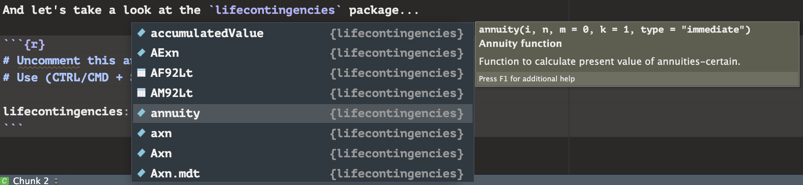

...but what is an annuity? Let's start with a definition for an annuity. An annuity is "A series of payments made at equal intervals of time-"; there are several examples of this type of payment: House mortgages or installment payments on large credit card purchases and automobile transactions. There are somethings to consider when finding the value of an annuity; let's start from the left and work our way to the right. The "$i$" is the effective interest rate applied to each payment made. The "$n$" is the number of payments that are going to be made over time. The "$m$" is the deferring period, which defaults to zero; the deferring period is the amount of periods that pass before the first and following payments. Without any deferring payments, $m = 0$, which is why it is zero by default. Payments can occur in different time frames though. They can happen annually (yearly), biannually, quarterly, monthly, biweekly, weekly, or even daily; the "$k$" term represents the number of payments within one year, so this will default to 1, but can be adjusted to be 2, 4, 12, 26, 52, and 365 (or 360 for "ordinary" counting) respectively. Finally, we have the "`type = 'immediate'`"; this means that the payment is made at the end of the payment period (as counter intuitive as that sounds). The `annuity` function will also default to "immediate"; if we did have payments at the beginning of each payment period, then we would want the `type` to be "due".

Here is what all of this looks like using actuarial notation...

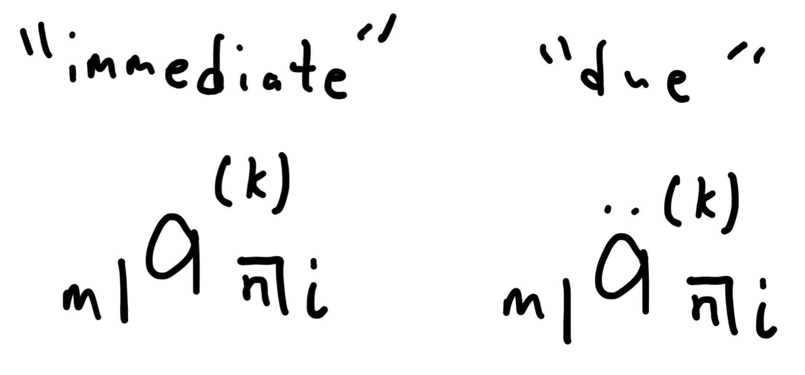

Notice how the "$a$" has nothing above it to represent the "immediate" type and has two dots above it to represent "due", but what is the "$a$"? The "$a$" is the last piece of the puzzle; this indicates the "present value" ($PV$), which is the sum of all the cash flows when considered in our current time. Think of it like this, a payment at the end of the year is affected by one year's worth of interest, yet a payment ten years later will have nine more year's worth of accumulated interest that needs to be considered. When adjusting payments to represent their amount in our current time, here is what the present value looks like on a time line...

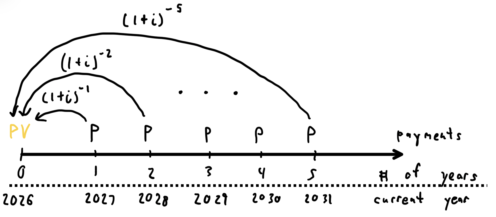

And down below, I have the geometric series version and the geometric formula of the present value represented as well...

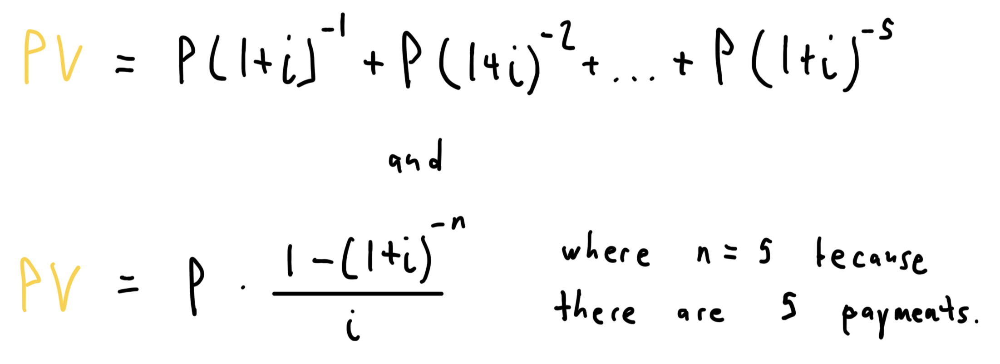

Now let's solve a financial math problem using both the geometric series and R studio. This question is one of the homework questions that I received during Winter 2025 in ACS 4550.

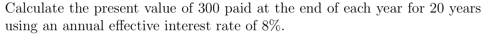

Okay, here are the components of this question...

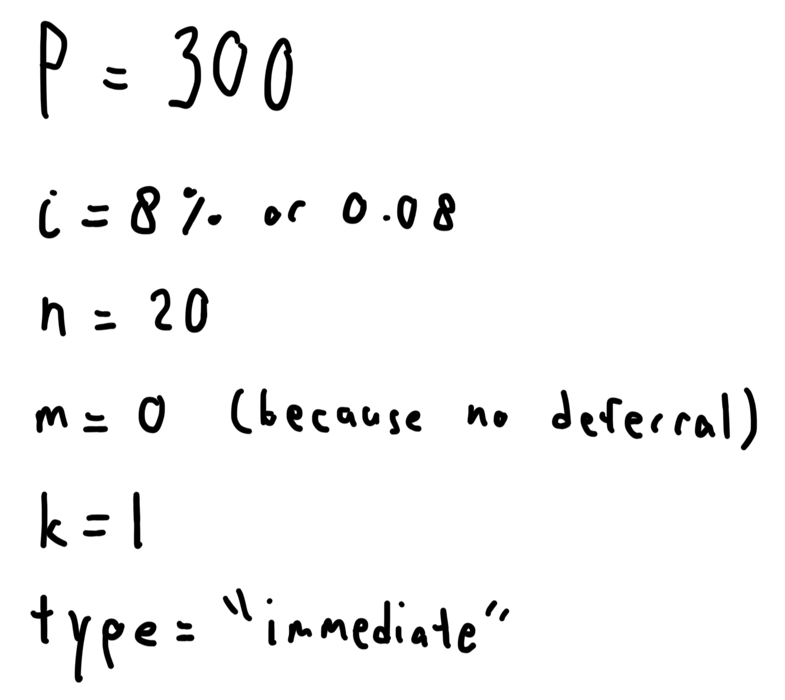

And here is the exact solution I produced a year and a half ago...

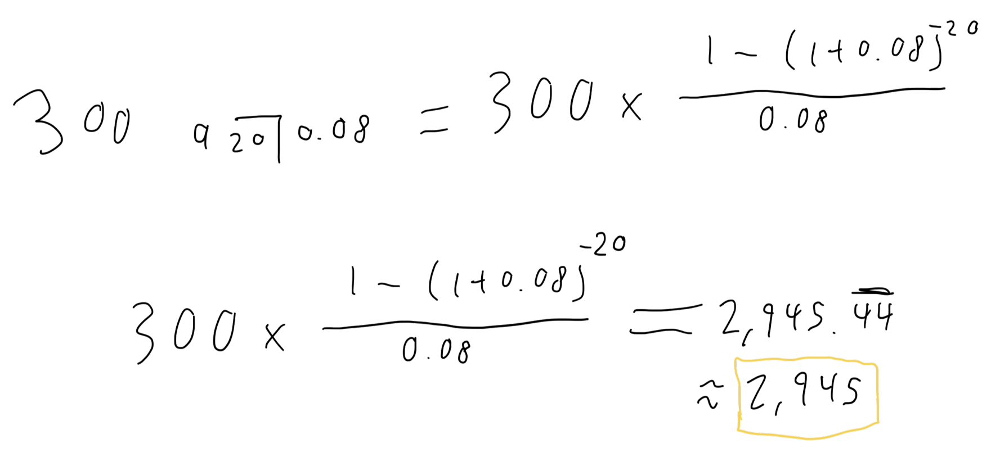

A couple things to note here, anytime there is anything that is consistent with the timing and payment periods, we do not need to acknowledge them through the work shown; this is why I do not have "$(1)$" as the k term nor do I have "$0 |$". This will also be true when utilizing R studio. Now, let's answer the question using R studio...

```{r Incomplete}
annuity(i = 0.08, n = 20, type = "immediate")
```

...wait, that's not right, and where do we put $P = 300$? The `annuity` function actually behaves just like our actuarial notation above, so we currently only have...

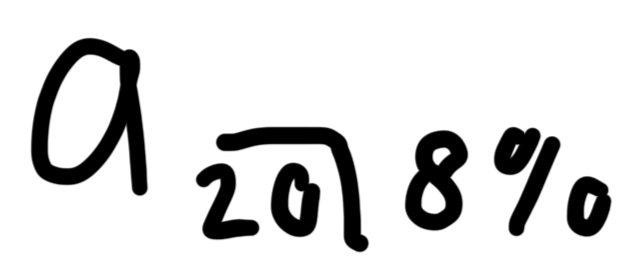

So just like the work that I show above, all we need to do is multiply the `annuity` function by three hundred to get the correct answer...

```{r Complete}
300 * annuity(i = 0.08, n = 20, k = 1, type = "immediate")
```

Tada! Before moving on, let's interpret this. What we are saying is, should we carry on with all of our cash flows, the total amount of money that we will be spending in today's money is about \$2,945.44. There is an opposite of this calculation called the "future value", but that is another topic for another time. For now, this wraps up our first look at "financial mathematics". Now we will get into some "fundamentals of actuarial mathematics".

## Fundamentals of Actuarial Mathematics

Several ideas from "financial mathematics" are further augmented to represent insurance and in this case, we will take a quick look into a life insurance topic. We are going to be looking into "life tables". There is going to be a lot more involvement with R studio to configure and infer information from what's provided. Notice that when using tab completion on `lifecontingencies::`, there are several data tables that read "demo-" followed by a country...


We are going to be working with "demoUsa" and "demoJapan", but first, let's look at the "Standard Ultimate Life Table" (SULT) below; "Ultimate" is a word used to describe the "total projection" of each record respectively. This table is created by using approximate trends to help infer information about the following record respectively; understanding this will be important for interpreting the table further.

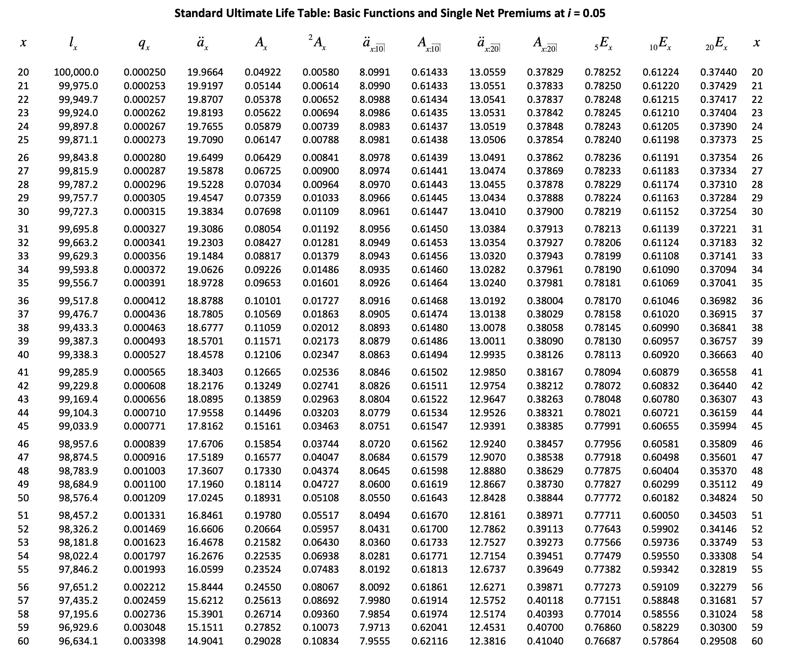 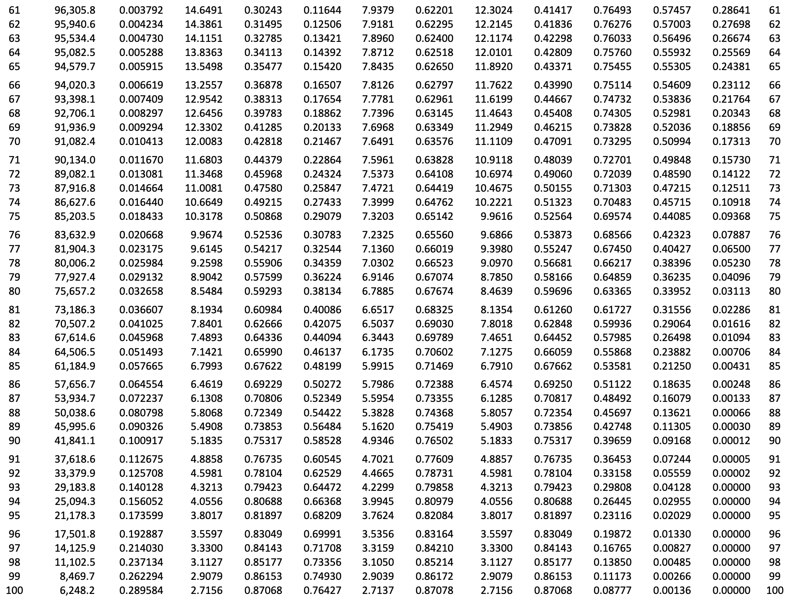

Beyond $q_x$ is actuarial notation that represents different forms of insurance; we won't be talking about those, but we will focus on these ones...

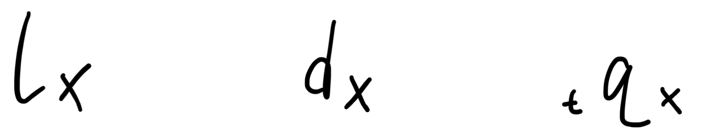

The "$l_x$" represents the quantity of individuals that are currently alive at the age of "$x$". The "$d_x$" represents the quantity of individuals that die during the age of $x$; this is not actually a part of the original SULT, but it tends to be inferred for learning and working with life tables, so we will do the same today. The "$q_x$" is the probability of an individual dying during their $x$ age; this can be derived if we take the $d_x$ and divide it by $l_x$ giving us...

$$q_x = \frac{d_x}{l_x}$$Notice that there is not a "$t$" in front of the $q_x$ expression; this is because if we are only addressing the ratio per year, then we do not include a number in front of it. We would include a $t$ value in front of $q_x$ if we are considering the probability of death after two or more years. But, why are we looking into life and death anyways? This is because when companies are providing monetary support to the insured, there is a proposed risk of the company needing to provide support at different times; because this cannot truly be known, companies need to consider the risk of death to continuously provide life insurance to the insured.

With the background needed to work with the `lifecontingencies` life tables, let's look at `demoUsa` and `demoJapan`...

```{r Overview}
head(demoUsa); tail(demoUsa)
head(demoJapan); tail(demoJapan)
```

Right away, we can tell a few things...

1.  Both tables consider gender while the SULT does not; we are going to take advantage of this for analysis.
2.  `demoUsa` has information on many years while `demoJapan` only features information from between 1985-1987 within one column. For comparing both countries later, we will limit the data within `demoUsa` to just the information from 1990 for a more "apples-to-apples" comparison with `demoJapan`.
3.  The headers make sense, but they are not consistent with each other nor do they utilize the actuarial notation that we just learned; I will change the column names to better reflect this.
4.  Both datasets gives us information about one country that the other does not; `demoUsa` gives us the $l_x$ for males and females while `demoJapan` gives us the $q_x$ for males and females. This will be a great learning opportunity to derive what's missing from each country.
5.  At the end of each dataset, there are NAs; this is because within the sample, everyone has died by each later age respectively. Not only that, but the $q_x$ appears to be equivalent to one in the later ages too; this is because when the remaining individual(s) die, we have a ratio that equates to one. For example, assume that $l_{100} = 2$ if those individuals die before the age of 101, then $d_{100} = 2$ as well, meaning $q_{100}$ would be as follows... $$q_{100} = \frac{d_{100}}{l_{100}} = \frac{2}{2} = 1.$$This reveals something interesting. Not only is $q_x$ a probability, it follows a "cumulative distribution function" (cdf), meaning the probability of death will always range between 0 and 1.

```{r Change Columns}
# Both newly created datasets represents males/females, thereby addressing "1"

USA <- demoUsa %>% 
  select(age, USSS1990M:USSS1990F) # Addressing "2"
colnames(USA) <- c("x", "lxMaleUSA", "lxFemaleUSA") # Addressing "3"

JPN <- demoJapan
colnames(JPN) <- c("x", "qxMaleJPN", "qxFemaleJPN") # Addressing "3"
```

Now let's take a look at both newly created datasets...

```{r New Columns}
head(USA)
head(JPN)
```

Now these look more consistent with the SULT. Working with `USA` first, let's get the $d_x$ values for both males and females. But, how do we do that? Looking back at the SULT, we can see that for every increase in the age within the table, the amount of people within the next $l_x$ decreases. When comparing between a "current" age and the "next" age, we can express the "next" age as "$l_{x+1}$"; this is key to derive another way to express $d_x$...

$$d_x = l_x - l_{x+1}$$Meaning, if we subtract the quantity of people of the next age from the quantity of people of the current age, we will get $d_x$. If we keep doing this for every age within the table, we can find $d_x$ for every age in the data for both genders, so let's do that. I will explain the reasoning for the code in steps...

1.  The later $l_x$ values consist of NAs; these need to be replaced with zeros as this acknowledges that no one from that respective category is alive anymore.
2.  From the left, I need to create a new column called `dxMaleUSA` within `USA`. To replicate the formula directly above, I need R to lag the data by one so then I can subtract the current information from the information prior; so, as a twist from the equation above, R is doing this $d_x = l_{x-1} - l_x$ instead, but will still consist of the same results.
3.  So far, every result from doing the math above works, but every value will be put in the row below the correct place, meaning every $d_x$ will be placed at $d_{x+1}$; this code will address the issue by shifting each result up by one.
4.  As noted earlier, the NAs mean that nobody is alive at "those" ages respectively, so anywhere that tried to do $NA_{x-1} - NA_x$ will just be 0. So let's change every NA with a zero.

All of these steps are replicated for females respectively. With all that being said, let's run the code and see what it looks like...

```{r Creating Each dx}
USA$lxMaleUSA[is.na(USA$lxMaleUSA)] <- 0
USA$dxMaleUSA <- (lag(USA$lxMaleUSA, 1) - USA$lxMaleUSA)
USA$dxMaleUSA <- c(USA$dxMaleUSA[-1], NA)
USA$dxMaleUSA[is.na(USA$dxMaleUSA)] <- 0

USA$lxFemaleUSA[is.na(USA$lxFemaleUSA)] <- 0
USA$dxFemaleUSA <- (lag(USA$lxFemaleUSA, 1) - USA$lxFemaleUSA)
USA$dxFemaleUSA <- c(USA$dxFemaleUSA[-1], NA)
USA$dxFemaleUSA[is.na(USA$dxFemaleUSA)] <- 0

head(USA); tail(USA)
```

Nice, looks like it checks out! Notice how for males and females, $l_0 = 100000$. Then we recognize that $d_0 = 1028$ for males and $d_0 = 815$ for females, which gives us $l_1 = 98972$ for males and $l_1 = 99185$ for females; it is this that helps demonstrate that...

$$l_x - d_x = l_{x+1}$$as well. Now it is time to tackle $q_x$ since we know that every $l_x$ and $d_x$ is in order. Once again, I will explain the code in steps...

1.  From the left, I need to create a new column called `qxMaleUSA` within `USA`. Knowing that $q_x = \frac{d_x}{l_x}$, all we need to do is input the result for each age respectively.
2.  Now I am saying, "For any value in `qxMaleUSA` that is not NA, I want each respective value rounded to the fifth digit of the decimal"; I do this because the $q_x$ values in `JPN` are all approximate to the fifth digit as well, so it's more comparable this way.
3.  Like before, I do not want there to be mathematical operations being done with NAs; in this case, I don't want $\frac{NA}{NA}$, especially because if we assume that each NA is zero, then we would have $\frac{0}{0}$, which is indeterminate. There should not be any NAs anyways, but just in case, where there are NAs in `qxMaleUSA`, we will replace with zeros.

And like before, all of these steps apply for females as well. Now let's see what happens...

```{r Creating Each qx}
#| warning: false
USA$qxMaleUSA <- USA$dxMaleUSA / USA$lxMaleUSA
USA$qxMaleUSA[!is.na(USA$qxMaleUSA)] <- round(USA$qxMaleUSA, digits = 5)
USA$qxMaleUSA[is.na(USA$qxMaleUSA)] <- 0

USA$qxFemaleUSA <- USA$dxFemaleUSA / USA$lxFemaleUSA
USA$qxFemaleUSA[!is.na(USA$qxFemaleUSA)] <- round(USA$qxFemaleUSA, digits = 5)
USA$qxFemaleUSA[is.na(USA$qxFemaleUSA)] <- 0

head(USA); tail(USA)
```

Awesome! On the tail end of the dataset, you can see that for females, $q_{113} = 0.000000$, which does not seem intuitive reaching such an old age, but that is just because that individual did not die while they reached their 114th birthday. Most likely, that individual died after the data was done being recorded. Otherwise, we can see the cdf with $q_x$, which is great!

Now for comparison with `JPN` later, I will rearrange the columns so that it follows `x`, `lxMaleUSA`, `dxMaleUSA`, `qxMaleUSA`, `lxFemaleUSA`, `dxFemaleUSA`, `qxFemaleUSA` and I will limit the rows so that we only see the information up to the age of 100...

```{r Column Order}
USA <- USA[(1:101), c(1, 2, 4, 6, 3, 5, 7)]

head(USA); tail(USA)
```

Perfect! Now let's start working with `JPN` and modify the life table. First, let's reminds ourselves of what we're working with...

```{r Overview JPN}
head(JPN); tail(JPN)
```

In this case, we are actually going to be working backwards; instead of utilizing $l_x$ to get $d_x$ and then $q_x$, we are going to utilize $q_x$ to get $l_x$ and then $d_x$. Let's look at one particular relationship between the three of these again...

$$q_x = \frac{d_x}{l_x}.$$Now, if we actually multiply both sides by $l_x$, we get...

$$l_xq_x = d_x.$$
How can we work with this though? I am going to make a bold assumption; just like how $l_0 = 100000$ for both males and females in the United States life table, I am going to assume the same thing for males and females in Japan; this way, we can derive a value for $d_0$. Now let's get the value of $d_0$ for males...

$$l_0q_0 = 100000 \times 0.01028 = 1028 = d_0.$$Remember, knowing that $d_x = l_x - l_{x+1}$, we can add $l_{x+1}$ to both sides and subtract $d_x$ from both sides, resulting in...

$$l_{x+1} = l_x - d_x.$$Knowing this, let's plug in everything to get $l_1$ for males...

$$l_1 = l_0 - d_0 = 100000 - 1028 = 98972$$

Great! Now, this is what we need to do for every $l_x$ value; working with R, we will do this...

1. I wanted to set the value of $l_x = 100000$ just as a start for both Males and Females.
2. It is this step and every line afterwards that utilizes a "for loop" reminiscent of the lesson within [intro2r](https://intro2r.com/loops.html). Let's start at the first line of the loop; I recognize that I already set the data between rows 1:101, however, what I need this to operate on is between rows 1:100 because I will not have the 101st row represented to plug values into this later, so for every row between 1:100...
3. I am creating the column inside of `JPN` called `dxMaleJPN` through the action of $l_x \times q_x$ from before; notice I want this value to be rounded so it's consistent with the `USA` life table.
4. Then I am performing $l_x - d_x$ and putting the result into the next $l_x$, so into $l_{x+1}$; notice how this automatically replaces every 100000 except for the one in $l_0$, which is perfect!

Just like before, this loop can be repeated for females respectively, and then...

```{r Creating Each lx and dx}
JPN$lxMaleJPN <- 100000
  for (i in 1:100) {
  JPN$dxMaleJPN[i] <- round(JPN$lxMaleJPN[i] * JPN$qxMaleJPN[i], digits = 0)
  JPN$lxMaleJPN[i + 1] <- JPN$lxMaleJPN[i] - JPN$dxMaleJPN[i]
  }

JPN$lxFemaleJPN <- 100000
  for (i in 1:100) {
  JPN$dxFemaleJPN[i] <- round(JPN$lxFemaleJPN[i] * JPN$qxFemaleJPN[i], digits = 0)
  JPN$lxFemaleJPN[i + 1] <- JPN$lxFemaleJPN[i] - JPN$dxFemaleJPN[i]
  }

head(JPN); tail(JPN)
```

...eh. It looks kind of weird at the end of the loop, but remember, I did only set this loop between 1:100, so there is more data than I told the loop to operate on. An "i" value was also created from both loops, which can easily be removed with `rm()`. Let's remove the i, remove the extra rows in `JPN`, and even rearrange the columns to match the order of the `USA` data...

```{r Remove/Rearrange}
rm(i)

JPN <- JPN[(1:101), c(1, 4, 5, 2, 6, 7, 3)]

head(JPN); tail(JPN)
```

Fantastic! It can be overwhelming to "memorize" the many relationships between $l_x$, $d_x$, and $q_x$, but don't worry! A lot of these relationships I mentioned can be derived by basic algebraic techniques; it's incredible how much can be inferred from algebra still, especially in this context!

To wrap up on this discussion, let's take some time to visualize the results we got and see if there's something that we can infer from it. Now, I am going to assume that you have familiar background in working with ggplot thanks to Professor Isken's teachings and resources like [intro2r](https://intro2r.com/); if you need review though, feel free to look at the resources for reference. Let's get into the analytics...

First, I am visualizing the $q_x$ with respect to `USA` based on gender; it has been acknowledged that men tend to live shorter lives than women, but what do you think? Based on the results from our final life table, do you think this statement holds? If it does, then there should be a larger probability of death for men within each year than there should be for women. Let's see...

```{r USA: Males vs Females}
ggplot(data = USA) +
  geom_line(aes(x = x, y = qxMaleUSA, color = "blue")) +
  geom_line(aes(x = x, y = qxFemaleUSA, color = "red")) +
  labs(title = "qx for Males versus Females in USA", color = "Gender") +
  scale_color_manual(labels = c("Male", "Female"), values = c("blue", "red")) +
  xlab("x = age") +
  ylab("qx") +
  theme_classic()
```

And there it is! Now this does not truly confirm the statement by itself, but it is a convincing result that the statement could be true. Notice something else interesting? It is right at the beginning of the plot, but there actually is a higher probability of death for infants than there is for every age up to the age of 50 for men and about 65 for women; we could have even hypothesized and tested this statement as well. Let's take a look at the $q_x$ levels for males and females in `JPN` now...

```{r JPN: Males vs Females}
ggplot(data = JPN) +
  geom_line(aes(x = x, y = qxMaleJPN, color = "blue")) +
  geom_line(aes(x = x, y = qxFemaleJPN, color = "red")) +
  labs(title = "qx for Males versus Females in JPN", color = "Gender") +
  scale_color_manual(labels = c("Male", "Female"), values = c("blue", "red")) +
  xlab("x = age") +
  ylab("qx") +
  theme_minimal()
```

...and yep! We can notice the trend here too that males tend to have a higher probability of death than females. There is something to pick up on here too; here, notice that the $q_x$ levels tend to be higher in `JPN` than in `USA`. I mentioned it earlier, but this could have to do with the `JPN` life table having its data collected earlier than the `USA` life table; as time passes, people are finding more ways to extend everyone's lives, thus, biasing our comparisons to be slightly off (not quite "apples-to-apples" comparison, but still close). We will see this when we compare males from both countries too; let's do that...

```{r Males: USA vs JPN}
ggplot() +
  geom_line(data = USA, aes(x = x, y = qxMaleUSA, color = "blue")) +
  geom_line(data = JPN, aes(x = x, y = qxMaleJPN, color = "red")) +
  labs(title = "qx for Males: USA versus JPN", color = "Country") +
  scale_color_manual(labels = c("USA", "JPN"), values = c("blue", "red")) +
  xlab("x = age") +
  ylab("qx") +
  theme_light()
```

Interesting! Earlier, I mentioned that $q_x$ rates tend to be higher for infants; here, we can see that being the case for Males in the US, but in Japan, the mortality rates are actually really small at this point. Another interesting point is that for a good while, the $q_x$ rates for the US tend to be higher until around the age of 80; then we see an overlap and JPN overtakes the US for having higher mortality rates. We have inferred this much between males of two different countries. Now let's see for females from `USA` and `JPN`...

```{r Females: USA vs JPN}
ggplot() +
  geom_line(data = USA, aes(x = x, y = qxFemaleUSA, color = "blue")) +
  geom_line(data = JPN, aes(x = x, y = qxFemaleJPN, color = "red")) +
  labs(title = "qx for Females: USA versus JPN", color = "Country") +
  scale_color_manual(labels = c("USA", "JPN"), values = c("blue", "red")) +
  xlab("x = age") +
  ylab("qx")
```

...and there you have it! It seems that the differences in $q_x$ between females in the US and Japan are not as different as they are for males though.

And that wraps up the discussion on one topic among many other topics within life insurance! I hope that this demonstrates the power behind the functions of `lifecontingencies::` mixed with the analytics with `ggplot`!